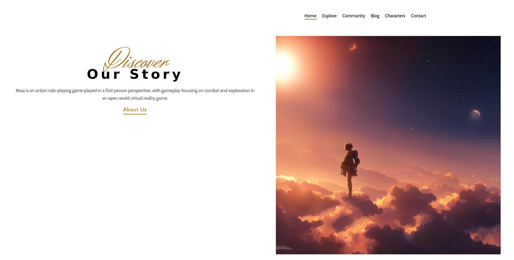
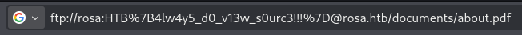
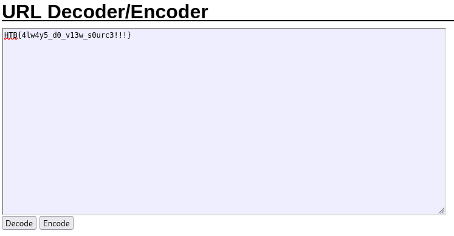

# Arcane Source

Sulla pagina principale troviamo solo una form e un link.

Cliccando sul link 'about us', e aprendolo in una nuova tab, si nota che la flag è nel URL

Decodificando la flag con un Base64 URL decoder, la otteniamo in chiaro

