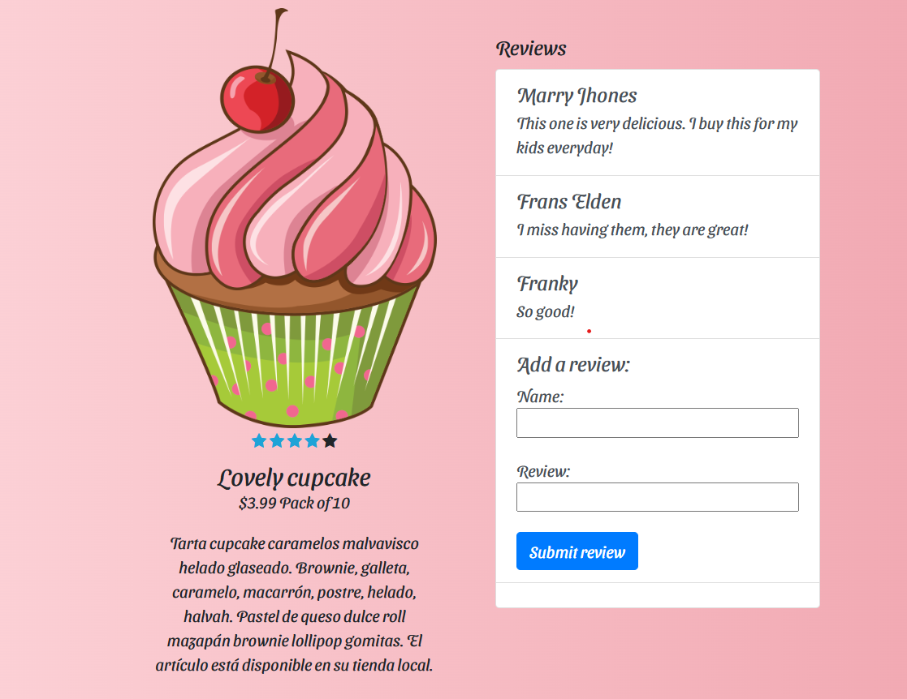
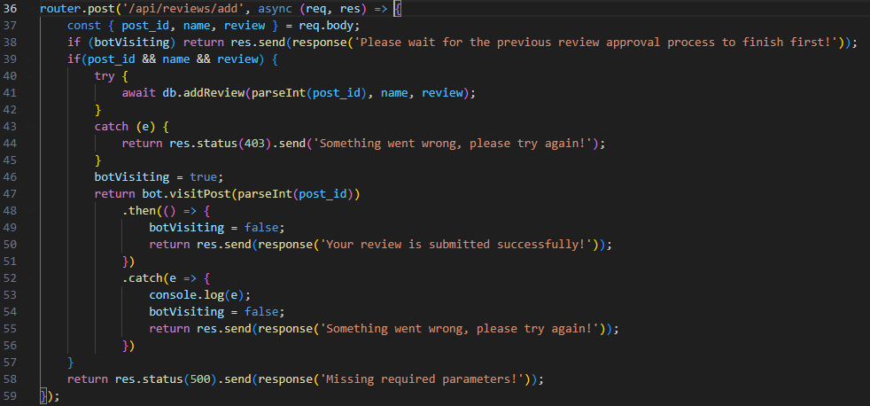
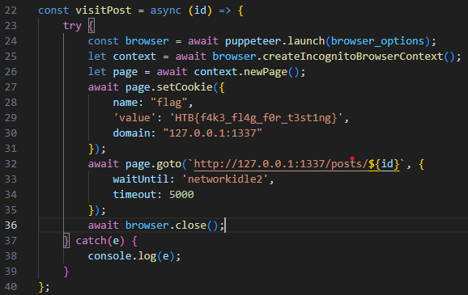
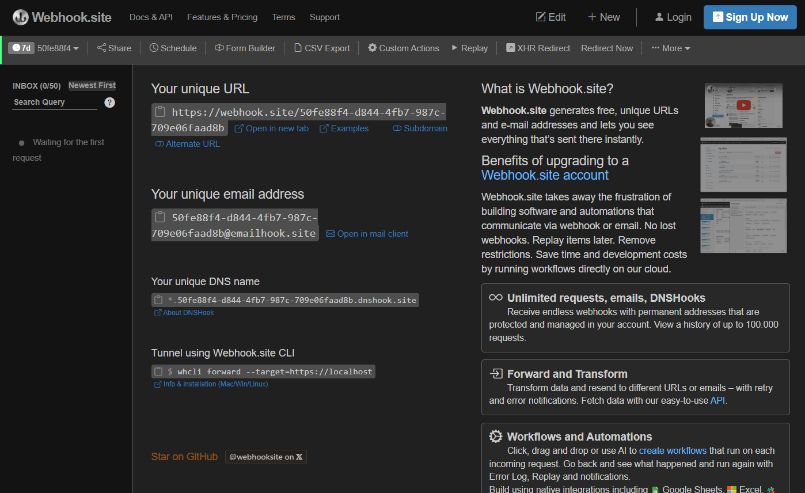
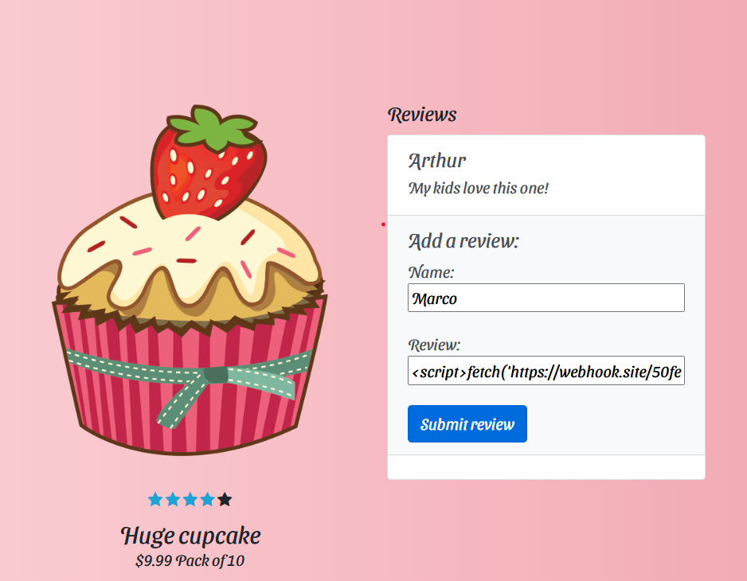
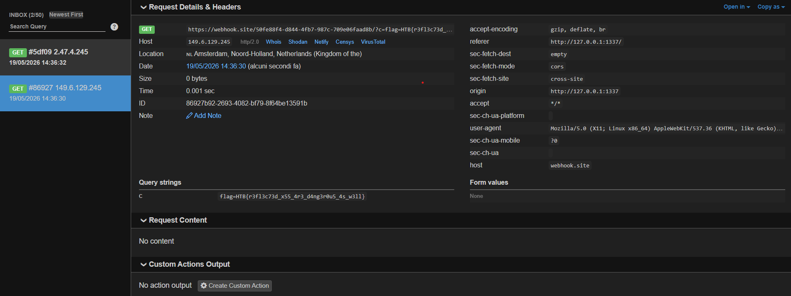

# Cupcake Magdalena

Sulla pagina principale si nota che possiamo visualizzare dei dettagli di cupcake e salvare la nostra recensione

Nel codice sorgente vediamo che questa è una app in node.js. Dentro /routes/index.js c'è la chiamata che salva le reviews

Questa funzione chiama la funzione visitPost dentro bot.js, la quale va a visitare il post appena creato tramite browser, settando come cookie la flag

Questo vuol dire che possiamo provare un attacco XSS, prepariamo un server http con webhook.site per ricevere la flag

Aggiungiamo una recensione, dove nel campo review salviamo uno script che faccia una fetch al nostro webhook e che come parametro URL abbia il cookie di sessione: \

Ora, in webhook aspettiamo la richiesta con la flag

