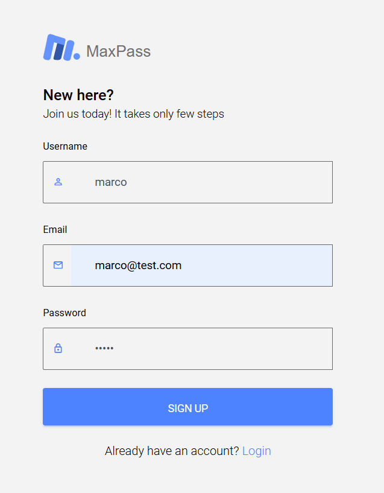
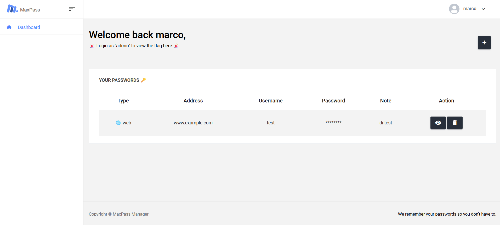
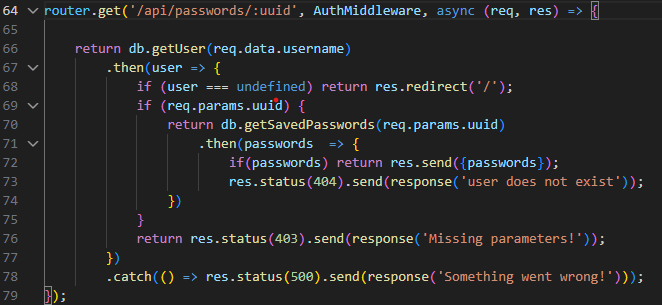
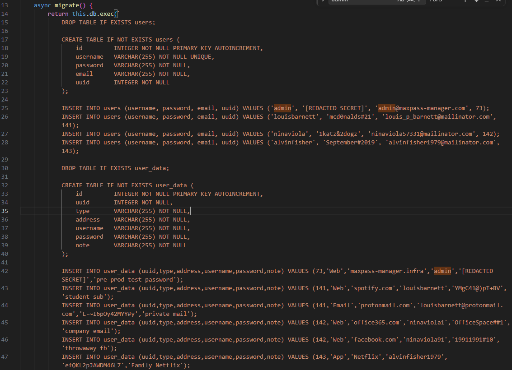
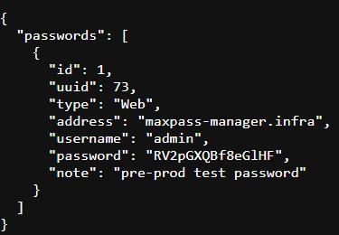

# MAXPASS MANAGER

Nella pagina di atterraggio c'è una form dove possiamo creare un utente e loggarci

Una volta loggati vediamo che questa app è un password manager e sotto la scritta di benvenuto dice ci loggarci come admin per vedere la flag

Nel codice sorgente, dentro routes/index.js, si può fare una chiamata GET a /api/passwords/:uuid, e specificando un id utente, sarà possibile vedere tutti i suoi dati, serve solo essere autenticati, con qualsiasi utente

Dentro il file database.js vediamo che lo uuid di admin è 73

Quindi facendo una richesta get a http://\<ip>:\<porta>/api/passwords/73 è possibile vedere la psw di admin

Ora loggandoci con le credenziali di admin possiamo vedere la flag

