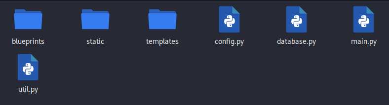
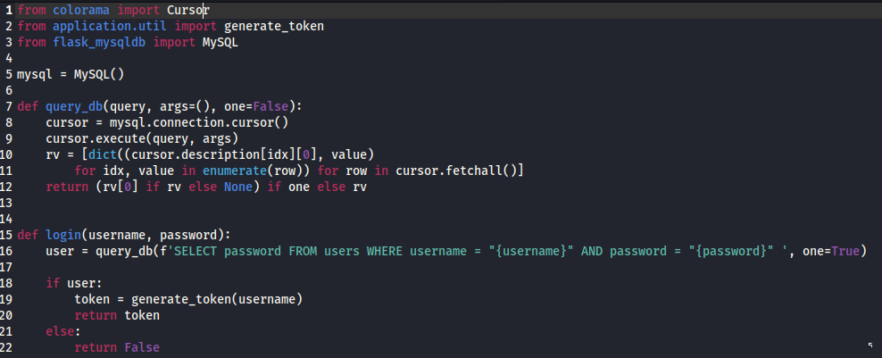
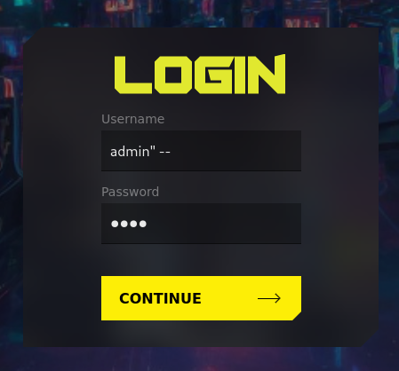
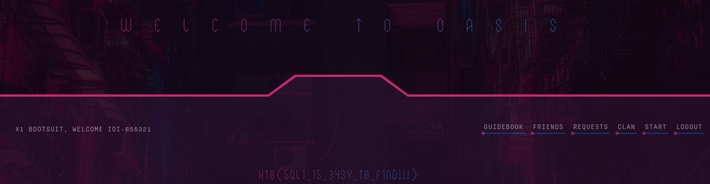

# OASIS

La pagina di atterragio ha solo una form di login, ma non abbiamo delle credenziali

Possiamo scaricare il codice sorgente, e dentro la cartella challenge. vediamo che questa è una app scritta in python

Cerchiamo delle credenziali dentro database.py ma troviamo la funzione di login, la quale prende username e password e li passa nella query senza sanificarli

Proviamo un SQLi cercando di autenticarci come admin, inserendo nello username: \<admin" -- >, con lo spazio finale e una qualsiasi password

In questo modo riusciamo ad autenticarci e una volta dentro, troviamo subito la flag

