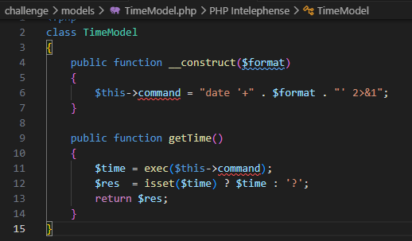
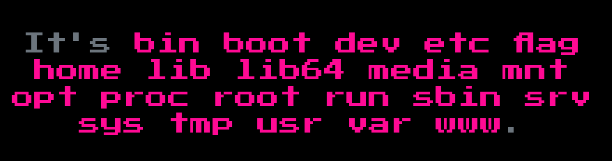
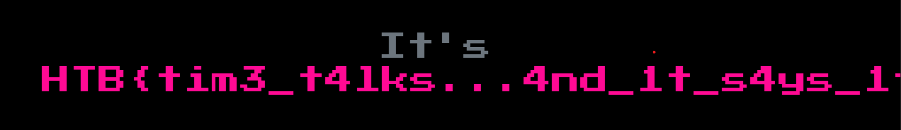

# TimeTok

Nella pagina su cui atterriamo ci sono due pulsanti che mettono come parametro URL il formato della data o dell'orario e questo formato viene trasformato nella data odierna o nell'orario corrente del server

Possiamo scaricare il codice sorgente, dal quale vediamo che questa è una app in php e dentro Models/TimeModel.php arriva il formato dell'ora o della data, viene formata una stringa col comando date più il formato e viene passata alla funzione exec()

Questo formato non viene sanificato, quindi per passargli il payload corretto dobbiamo chiudere il singolo apice ed il comando precedente con il ';', poi scriviamo il nostro comando e commentiamo tutto quello che c'è dopo in questo modo: ';id;#
Trasformandolo in base64 url diventa così http://\<ip>:\<port>/?format=%27;id;%23

La funzione exec() restituisce solo l'ultima riga del comando, quindi usiamo ';ls /|xargs;# per avere tutto su una riga

Vediamo che la flag è nella root directory, prendiamola con ';cat /flag;#

