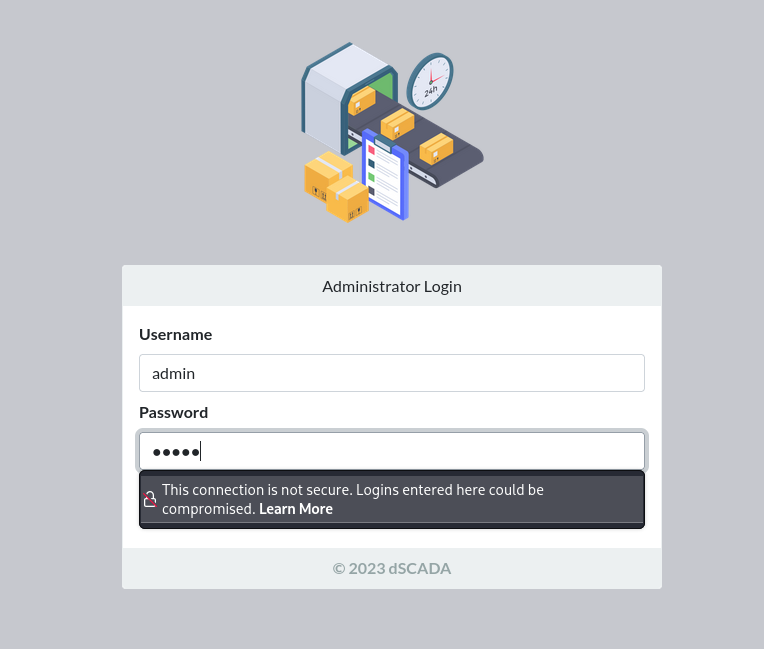
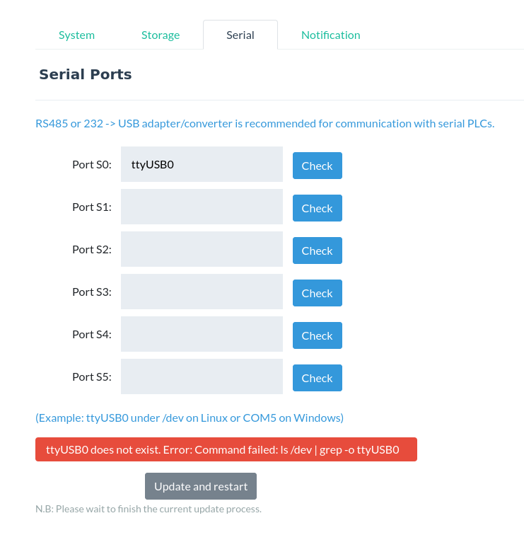
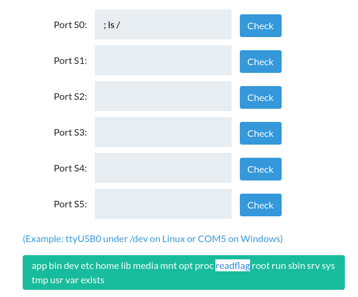
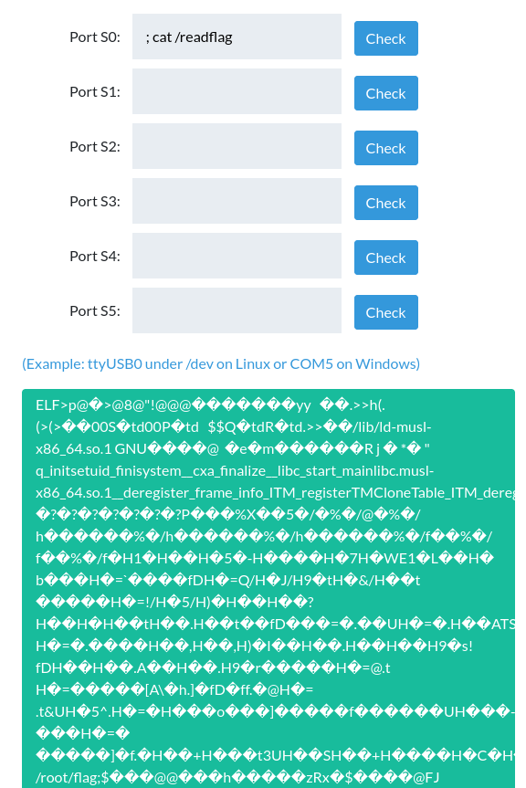
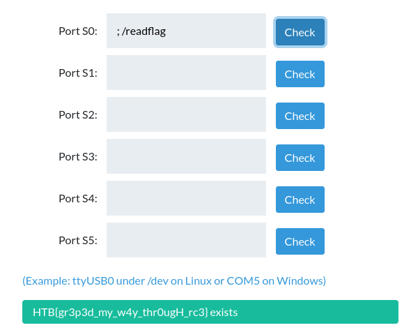

# dSCADA

Sulla pagina principale c'è una form di login per gli amministratori, proviamo quindi con delle credenziali deboli, admin:admin funziona

Una volta loggati, nella pagina settings, vediamo che sotto la tab 'Serial' si possono fare dei check, provando uno dei due esempi, risponde mostrando il comando che viene lanciato lato server

Quello che scriviamo verrà messo dopo il 'grep -o', quindi separiamo i comandi con ';' e diamo un'occhiata alla root directory. Qui troviamo il file readflag

Proviamo ad aprirlo e vediamo che è un file ELF, quindi un eseguibile

Eseguendolo riusciamo ad ottenere la flag

